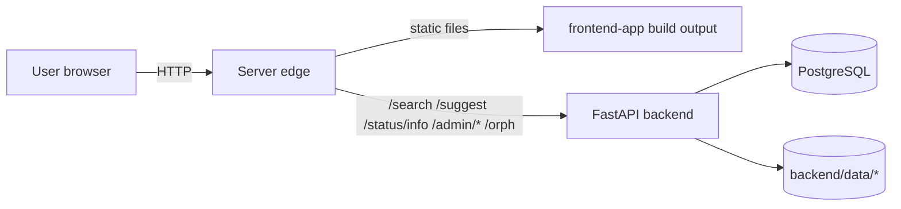

# System Spec

This spec describes the Stage I (prod) system as implemented in `/home/avo/rueo_master`.

## Overview

Rueo is a dictionary web app. A FastAPI backend provides:
- dictionary search and suggestions (HTML returned inside JSON)
- status/info text about the last dictionary update
- a feedback endpoint for typo reports
- admin endpoints to run the import pipeline

The primary end-user UI is the Quasar/Vue app under `frontend-app/`. This repo also contains a minimal static frontend under `frontend/`, used for quick smoke tests and the `/admin/ui` legacy page.

## High-level architecture

Notes
- The edge in production is documented as nginx proxy notes (`memory-bank/docs/DEPLOYMENT_NOTES.md`).
- The frontend PWA build includes an Apache-style `.htaccess` for cache headers and SPA routing (`frontend-app/public/.htaccess`).

Code references
- FastAPI app and routes: `backend/app/main.py`, `backend/app/admin.py`.
- Search implementation: `backend/app/services/search.py`.
- DB models and connection: `backend/app/models.py`, `backend/app/database.py`.
- Import pipeline: `backend/app/importer.py` and automation wrapper `scripts/rueo_update.sh`.
- Quasar frontend app: `frontend-app/`.

## Runtime components

### Backend (FastAPI)
- Entrypoint: `backend/app/main.py`.
- Serves API routes and optionally serves legacy static frontend files from `frontend/` (see `backend/Dockerfile`).
- Initializes database schema on startup (`init_db()` in `backend/app/database.py`).

### Database (PostgreSQL)
- Tables are created from SQLAlchemy metadata (no migrations in this repo).
- Key tables:
  - `artikoloj`, `artikoloj_ru` (raw article bodies)
  - `sercxo`, `sercxo_ru` (search index entries)
  - `neklaraj` (fuzzy mapping)
  - `statistiko` (search logging)
  - `article_*` tables (import/change tracking)
  - `users` (bootstrap admin user)
  See `backend/app/models.py`.

### Data files
- Source dumps (import input): `backend/data/src/`.
- Generated status/help files deployed with the site: `backend/data/tekstoj/klarigo.md` and `backend/data/tekstoj/renovigxo.md`.
- Import summary: `backend/data/tekstoj/tracking-summary.json`.
- Local logs directory used by the backend: `backend/data/logs/`.

### Frontend app (Vue + Quasar)
- App source: `frontend-app/src/`.
- News content file: `frontend-app/public/news.md` (Markdown; parsed client-side).
- PWA service worker (InjectManifest): `frontend-app/src-pwa/custom-service-worker.js`.
- Client-side update checker: `frontend-app/src/utils/cache-manager.js`.

## Stages and planning

This repo is Stage I (prod). Stage II and Stage III are planned/experimental work streams documented in `memory-bank/*`.

- Stage I: lift-and-shift replacement backend, current API surface.
- Stage II (planned in separate worktree): full-text search and parser experimentation (see `memory-bank/03_Stage2_Full_Text_Search.md`).
- Stage III (planned): semantic parsing and editorial admin UI (see `memory-bank/04_Stage3_Semantic_Parsing.md`).

See also workflow rules in `memory-bank/docs/WORKFLOW.md`.

## Stage I scope (completed)

From `memory-bank/02_Stage1_Lift_And_Shift.md`:
- Analyze legacy MariaDB schema and PHP logic (`sercxo.php`, `vortaro_updater_8.php`).
- Recreate importer logic in Python with a CLI for periodic runs.
- Implement API endpoints that replicate legacy behavior (search + suggest).
- Switch the frontend to the new endpoints and compare results to legacy output.
